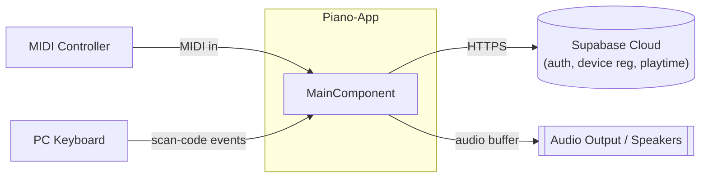
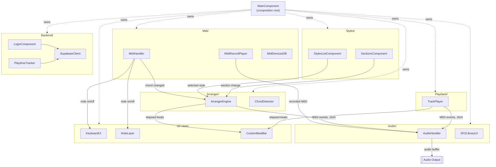
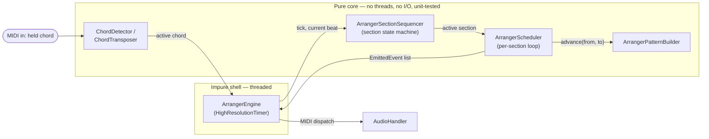

# Architecture

Piano-App is a JUCE (C++17) desktop arranger keyboard — the software counterpart to a
Yamaha PSR / Korg Pa. Standalone GUI app, not a plugin. Sound comes from sampled
instruments (SFZ), not synthesis.

## Subsystems

```
Source/
├── UI/        → MainComponent (composition root) + on-screen keyboard, display, view components
├── Midi/      → device I/O, PC-keyboard-as-piano, MIDI recording
├── Audio/     → 16 SFZ samplers (one per MIDI channel) + per-channel DSP effects chain
├── Arranger/  → auto-accompaniment engine: chord follow, section sequencing, style playback
├── Playback/  → classic multi-track MIDI player (TrackPlayer)
├── Styles/    → style authoring/browsing UI
├── Backend/   → Supabase: auth, MIDI device registration, playtime tracking
└── Common/    → shared interfaces/helpers (IOHelper, HelperFunctions, AppColours)
```

| Subsystem | Responsibility |
|---|---|
| **MIDI Handling** | Input from controller/PC keyboard, recording, device management |
| **Audio / SFZ** | Sound generation — 16-channel SFZ playback, MIDI-CC-driven effects (filter, distortion, chorus, reverb, tremolo, delay) |
| **Arranger Engine** | Auto-accompaniment: chord recognition, bar-synced section switching (Intro/Variation/Fill/Ending), per-track transposition |
| **Track Playback** | Classic multi-track sequencer — load a MIDI file, pick tracks, play along |
| **Styles System** | Style authoring UI: record a performance, carve it into sections, save as a `.style` file |
| **Backend** | Supabase-backed accounts, device registration, playtime tracking |
| **UI** | On-screen keyboard, transport/display, effect knobs — and `MainComponent`, which wires everything above together |

## Diagrams

### System context

External actors around the app boundary.



### Whole-app component diagram

`MainComponent` owns every subsystem (dotted = ownership) and they exchange data along
the solid, labeled edges.



### Arranger internal: pure core vs. impure shell

Zooming into `Arranger/` — the one subsystem architected differently from the rest of
the app (see [ADR-001](Piano-Wiki/wiki/decisions/ADR-001%20Pure%20Schedulers%20and%20Parallel%20Engine.md)).



## MainComponent: the composition root

`MainComponent` (`Source/UI/MainComponent.cpp`, ~3,000 lines) owns every subsystem
object directly as a member — `MidiHandler`, `AudioHandler`, `SFZLibraryUI`,
`ArrangerEngine`, `TrackPlayer`, `LoginComponent`, `PlaytimeTracker`, etc. — and connects
them with inline `std::function` callback assignments:

```cpp
midiHandler.onChordChanged = [this](const ArrangerChord& chord) { ... };
recordPlayer.onSfzMessage  = [this](const juce::MidiMessage& msg) { ... };
settingsWindow.onChordBassInversionChanged = [this](bool on) {
    display->setArrangerBassInversion(on);
};
```

This is standard JUCE style (`onClick`/`onXChanged` callback members are the framework's
own idiom), and matches how JUCE `Component`s are meant to own their children. There's no
event bus, DI container, or mediator — every subsystem reaches every other subsystem
*through* MainComponent, by name.

**Trade-off:** simple to read locally (no indirection — the callback body is right
there), but the file is the single highest-blast-radius place in the app. A change to
any subsystem's public interface likely means finding and editing the right spot among
dozens of similar callback assignments.

**Why it's left as-is:** this is a single-developer, single-window app with no current
need to construct subsystem groups in isolation (no second window, no headless mode, no
parallel-team work on disjoint areas). Splitting ownership into sub-owners, or adding
DI/an event bus, would add real structural indirection to solve problems (testability of
wiring, swappable implementations, multi-consumer reuse) that don't exist yet — worth
revisiting only if one of those needs actually shows up.

## Two parallel playback engines

`TrackPlayer` (classic multi-track MIDI playback) and `ArrangerEngine`
(auto-accompaniment) run **side by side** rather than being merged into one system.
Output is re-routed between them when switching; `MainComponent` owns both.

This is deliberate: they represent two distinct app **modes** — "playback mode" and
"arranger mode" — not one system with a legacy duplicate. They have genuinely different
state machines and notions of position (a fixed MIDI file vs. live chord-following +
section switches), so unifying them would force two different mental models into one
class. The cost is some duplicated concepts (timing, channel handling) between the two —
accepted as worth it for keeping each mode's logic simple and the older player
untouched/stable.

## Arranger core: pure logic, thin real-time shell

Unlike the rest of the app, the arranger's scheduling and section-sequencing logic is
**not** built from JUCE `Component`s/callbacks at all:

- **`ArrangerScheduler`, `ArrangerSectionSequencer`, `ArrangerPatternBuilder`,
  `ArrangerTime`** — plain classes, no threads, no I/O, no JUCE inheritance. E.g.
  `ArrangerScheduler::advance(fromBeats, toBeats)` takes numbers in, returns a
  `vector<EmittedEvent>` out. Fully unit-testable without any audio device or running
  app — and it is (1,300+ test assertions across 30+ suites).
- **`ArrangerEngine`** — the one impure piece: a `HighResolutionTimer` that calls into
  the pure scheduler above and turns its output into actual MIDI dispatch. This is the
  only part of the arranger that looks like the rest of the app (owned/wired by
  `MainComponent` the normal way).

This is a "functional core, imperative shell" split, chosen specifically because
real-time scheduling bugs are otherwise nearly impossible to catch outside live audio —
see `Piano-Wiki/wiki/decisions/ADR-001 Pure Schedulers and Parallel Engine.md`.

## Threading model

Audio thread, timer thread (arranger), and GUI/message thread exchange state only
through lock-guarded mailboxes — nothing mutates engine state directly from the message
thread. Instruments load asynchronously so the audio thread never blocks on file I/O.

## Where to look for more detail

The `Piano-Wiki/` directory (Obsidian vault, tracked in this repo) has a deeper,
per-module wiki — start at `Piano-Wiki/wiki/hot.md` for recent context, then
`Piano-Wiki/wiki/index.md` as the master catalog. This file is a static, higher-level
snapshot; the wiki is the living version.
